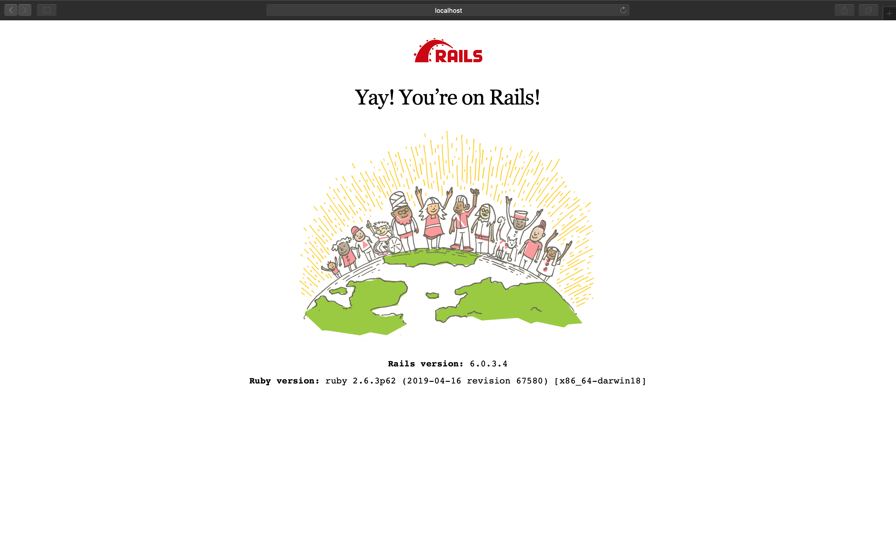
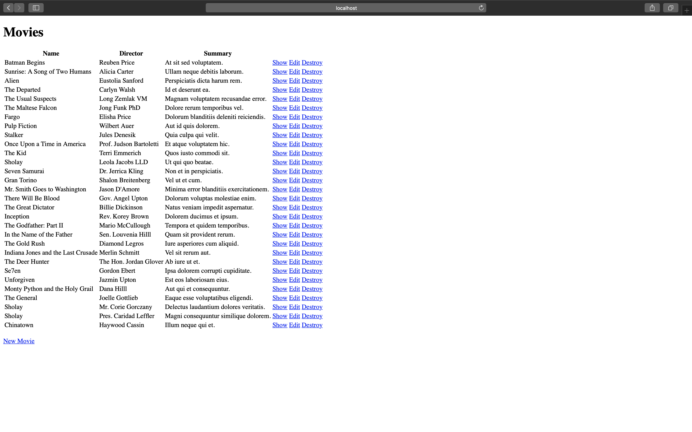
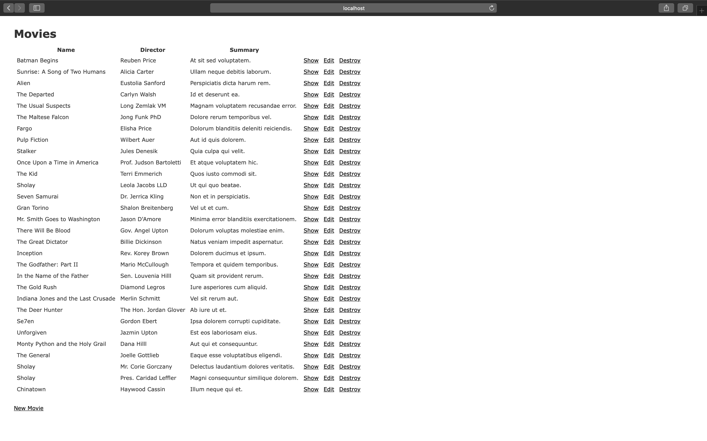
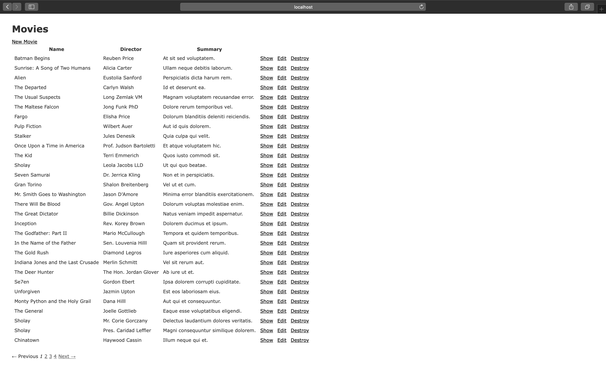
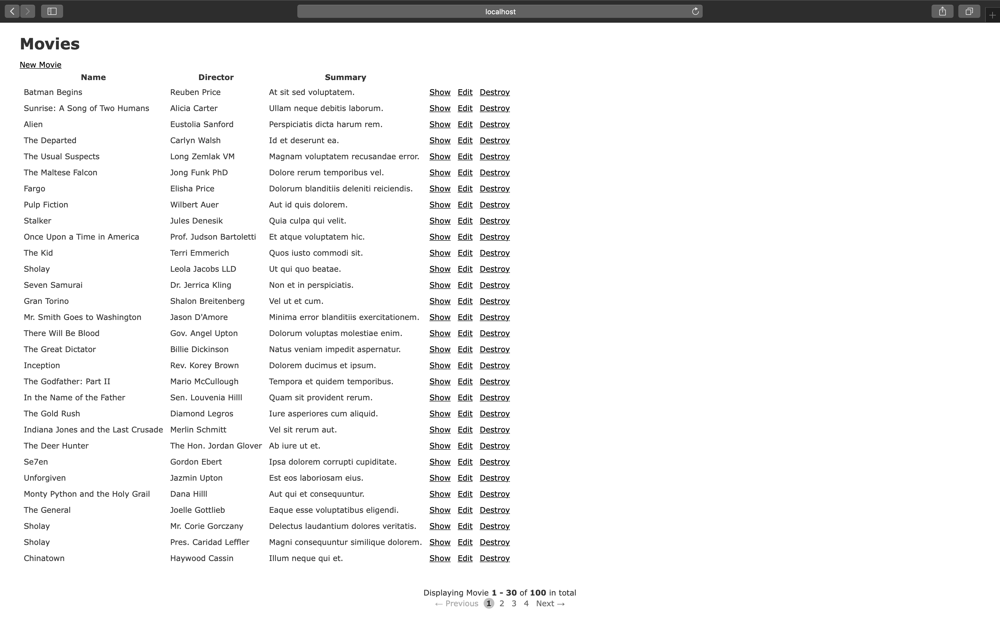

# Customizing Your User's Pagination Experience

<p align="center">
  
  
  
  
  
</p>

In this blog I will demonstrate how to set up a basic Ruby on Rails web app and implement a simple and stylish pagination component.

You can find the source code for this project below:

[](https://github.com/MatthewLaFalce/movie-demo)

## Tutorial

### Steps

<!--ts-->
1. [Create a New Rails Project](#1-create-a-new-rails-project)
2. [Generate Movie Model and Resources](#2-generate-movie-model-and-resources)
3. [Create Test Data](#3-create-test-data)
4. [Install Bootstrap](#4-install-bootstrap)
5. [Implement will_paginate Gem](#5-implement-will_paginate-gem)
6. [Customizing the Pagination Component](#6-customizing-the-pagination-component)
<!--te-->

### 1. Create a New Rails Project

Assuming Ruby and Rails are both installed on your local machine, enter the following command into your terminal replacing <project-name> with your new project's name. The `rails new` command creates a new Rails application with a default directory structure and configuration at the path you specify.

```bash
rails new <project-name> --database=postgresql
```

<b>Note:</b> The `--database` flag allows you to pre-configure your selected database (options: mysql, postgresql, sqlite3, oracle, frontbase, ibm_db, sqlserver, jdbcmysql, jdbcsqlite3, jdbcpostgresql, jdbc).

Once your project has finished generating, you will need to run `bundle install` from your projects root directory, as well as `rails db:create` to create your development and test databases.

Finally you can start your web application up for the first time by running `rails start` and if you visit `http://localhost:3000` you should see:


<!--  -->

### 2. Generate Movie Model and Resources

For this tutorial, we will create a model called Movie that will store basic information about our movie objects. Using the command below we will create the model, migration, tests, resource route, controller, and views.

```bash
rails g scaffold Movie name director summary:text --no-assets --no-helper --no-jbuilder
```

We will skip the creation of the assets, helper, and jbuilder files since they will not be necessary for this tutorial.

After running our database migration using `rails db:migrate` and restarting our web server, we can visit `http://localhost:3000/movies`. We will see a simple index view listing all of the movies in our database.

### 3. Create Test Data

Add the faker gem to your Gemfile -> `gem 'faker', :git => 'https://github.com/faker-ruby/faker.git', :branch => 'master'` in your development and test group. Then re-run `bundle install`.

The faker gem will generate fake data for your projects to help test and document your application. Using faker we will be able to efficiently seed our database from the seed file located in `db/seeds.rb`.

```ruby
#db/seeds.rb
require 'faker'

for m in 1..100 do
  name = Faker::Movie.title
  director = Faker::Name.name
  summary = Faker::Lorem.sentence
  Movie.create({name: name, director: director, summary: summary})
end
```

Once this has been added to your seed file, run `rails db:seed` and refresh your browser at `http://localhost:3000/movies` and you should see 100 new records are visible in your index view.

<!--  -->


More information about the faker gem can be found here:

[](https://github.com/faker-ruby/faker)

### 4. Install Bootstrap

We need to install jquery, popper.js, and bootstrap with yarn and configure webpacker for our rails 6 application. This should be run from the root of your project in your terminal.

```bash
yard add jquery popper.js bootstrap
```

Create the file `config/webpack/environments.js` and after the line, `const { environment } = require('@rails/webpacker')` add the following configuration.

```javascript
const webpack = require('webpack')
environment.plugins.append('Provide', new webpack.ProvidePlugin({
  $: 'jquery',
  jQuery: 'jquery',
  'window.jQuery': 'jquery',
  Popper: ['popper.js', 'default']
})
```

We also need to add:
```rb
<%= stylesheet_pack_tag 'application', media: 'all', 'data-turbolinks-track': 'reload' %>
```
to `app/views/layouts/application.html.erb` and
```javascript
import 'bootstrap/dist/js/bootstrap'
import 'bootstrap/dist/css/bootstrap'
```
to `app/javascript/packs/application.js`.

When the previous steps are completed all that is left is to restart your web server. Your page should now look like:

<!--  -->


### 5. Implement will_paginate Gem

We can add the `will_paginate` gem to our Gemfile using `bundle add will_paginate`. This will add and install the gem to our bundle.

Next, we need to paginate our query that is populating our page. This query can be found in the movies controller, `app/controllers/movies_controller.rb`. Our current index methods exists as:

```ruby
# GET /movies
# GET /movies.json
def index
  @movies = Movie.all
endV
```

In order to paginate our query to show only 30 results per page, we will need to modify it as such:

```ruby
# GET /movies
# GET /movies.json
def index
  @movies = Movie.all.paginate(page: params[:page], per_page: 30)
end
```

Now that our query is properly paginated, we can move on to showing the pagination compenent in our view. At the bottom of our index view, `app/views/movies/index.html.erb`, we can add `<%= will_paginate @movies %>`.
To clean up our view, it is recommended to move the `New Movie` button to the top of the page, just under `<h1>Movies</h1>`.

Our resulting view should look like:

<!--  -->


### 6. Customizing the Pagination Component

Built into the will_paginate gem is another rails helper, `page_entries_info`. When this helper is used it generates summary information about your query including the model name, total number of records returned, and the current record range that the page is displaying.

To add this summary information you can add it as such above your `will_paginate` component:

```ruby
<div class="page_info">
  <%= page_entries_info @movies %>
</div>
```

The result should look like:

<!--  -->


With a little CSS you can style your new components to look much more modern and friendly for your users. The creators of `will_paginate` have provided a few samples for you to use which can be found [here](http://mislav.github.io/will_paginate/). I have taken this concept a step farther and customized my own styling. To implement this styling you will need to import a custom stylesheet and wrap your components in another `div`.

First we will create the custom style sheet in `app/assets/stylesheets/custom/pagination.scss`:

```css
/* app/assets/stylesheets/custom/pagination.scss */

.pear_pagination {
  text-align: center;
  padding: 1em;
  cursor: default;
}
.pear_pagination a,
.pear_pagination span {
  padding: 0.2em 0.3em;
}
.pear_pagination .disabled {
  color: #aaaaaa;
}
.pear_pagination .current {
  font-style: normal;
  font-weight: bold;
  background-color: #bebebe;
  display: inline-block;
  width: 1.4em;
  height: 1.4em;
  line-height: 1.5;
  -moz-border-radius: 1em;
  -webkit-border-radius: 1em;
  border-radius: 1em;
  text-shadow: rgba(255, 255, 255, 0.8) 1px 1px 1px;
}
.pear_pagination a {
  text-decoration: none;
}
.pear_pagination a:hover,
.pear_pagination a:focus {
  text-decoration: underline;
}
```

Once we have created our style sheet we need to make sure that the style sheet is imported into our application's stylesheet by adding the following to `app/assets/stylesheets/application.scss`

```css
/* app/assets/stylesheets/application.scss */

@import "custom/pagination";
```

Finally we can wrap our components with our new `.pear_pagination` CSS class:

```ruby
<div class="pear_pagination">
  <div class="page_info">
    <%= page_entries_info @movies %>
  </div>
  <%= will_paginate @movies %>
</div>
```

Your final product should look like:

<!--  -->


### Conclusion

There are many ways out there to achieve the same outcome, but following this guide will ensure a quick and painless path to achieving an simple and modern pagination experience for your users.
